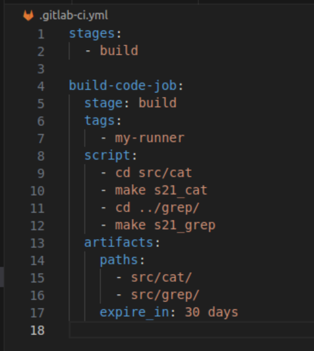

## Part 1. Настройка gitlab-runner

##### Поднять виртуальную машину *Ubuntu Server 20.04 LTS*
##### Скачать и установить на виртуальную машину gitlab-runner
``` brew
sudo curl -L --output /usr/local/bin/gitlab-runner "https://gitlab-runner-downloads.s3.amazonaws.com/latest/binaries/gitlab-runner-linux-amd64"
curl -L https://packages.gitlab.com/install/repositories/runner/gitlab-ci-multi-runner/script.deb.sh | sudo bash
sudo chmod +x /usr/local/bin/gitlab-runner
sudo useradd --comment 'GitLab Runner' --create-home gitlab-runner --shell /bin/bash
sudo gitlab-runner install --user=gitlab-runner --working-directory=/home/gitlab-runner
```
##### Запустить gitlab-runner и зарегистрировать его для использования в текущем проекте (DO6_CICD)
``` brew
sudo gitlab-runner start
sudo gitlab-runner register
```


## Part 2. Сборка
### Написать этап для CI по сборке приложений из проекта C2_SimpleBashScripts:
##### В файле gitlab-ci.yml добавить этап запуска сборки через мейк файл из проекта C2
##### VФайлы, полученные после сборки (артефакты), сохранять в произвольную директорию со сроком хранения 30 дней.



### Part 3. Тест кодстайла
#### Написать этап для **CI**, который запускает скрипт кодстайла (*clang-format*):
##### Если кодстайл не прошел, то "зафейлить" пайплайн
##### В пайплайне отобразить вывод утилиты *clang-format*


### Part 4. Интеграционные тесты
#### Написать этап для **CI**, который запускает ваши интеграционные тесты из того же проекта:
##### Запускать этот этап автоматически только при условии, если сборка и тест кодстайла прошли успешно
##### Если тесты не прошли, то "зафейлить" пайплайн
##### В пайплайне отобразить вывод, что интеграционные тесты успешно прошли / провалились


### Part 5. Этап деплоя
##### Поднять вторую виртуальную машину *Ubuntu Server 20.04 LTS*
#### Написать этап для **CD**, который "разворачивает" проект на другой виртуальной машине:
##### Запускать этот этап вручную при условии, что все предыдущие этапы прошли успешно
##### Написать bash-скрипт, который при помощи **ssh** и **scp** копирует файлы, полученные после сборки (артефакты), в директорию */usr/local/bin* второй виртуальной машины
##### В файле _gitlab-ci.yml_ добавить этап запуска написанного скрипта
##### В случае ошибки "зафейлить" пайплайн


### Part 6. Дополнительно. Уведомления
##### Настроить уведомления о успешном/неуспешном выполнении пайплайна через бота с именем "[ваш nickname] DO6 CI/CD" в *Telegram*


